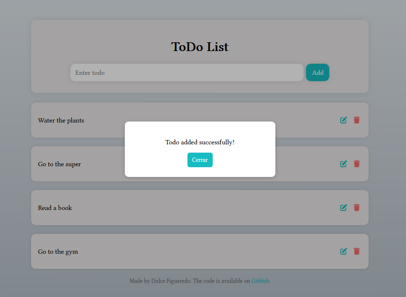
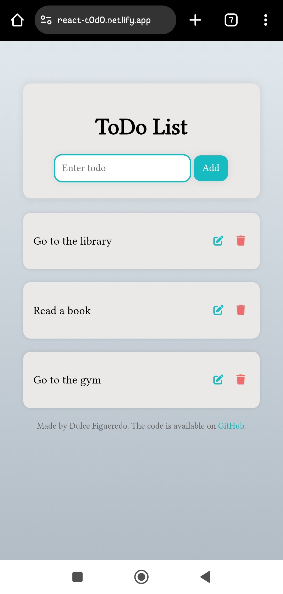

## React ToDo App

  This ToDo web application, developed with React.js, allows users to manage their tasks efficiently and easily. Its main features include:    
  - Add, edit, and delete tasks: Users can create new tasks, modify them, or delete them according to their needs.  
  - Responsive design: The interface automatically adapts to different devices, providing an optimal experience on both computers and mobile devices.  
  - Dynamic modal alerts: Every important action, such as adding, editing, or deleting a task, triggers a customized modal alert that informs the user about the outcome of the action (for example, a success notification when a new task is added).  

  
  The app is hosted on <a href="https://react-t0d0.netlify.app/">netlify</a>

### Web ToDo view

### Mobile ToDo responsive view

